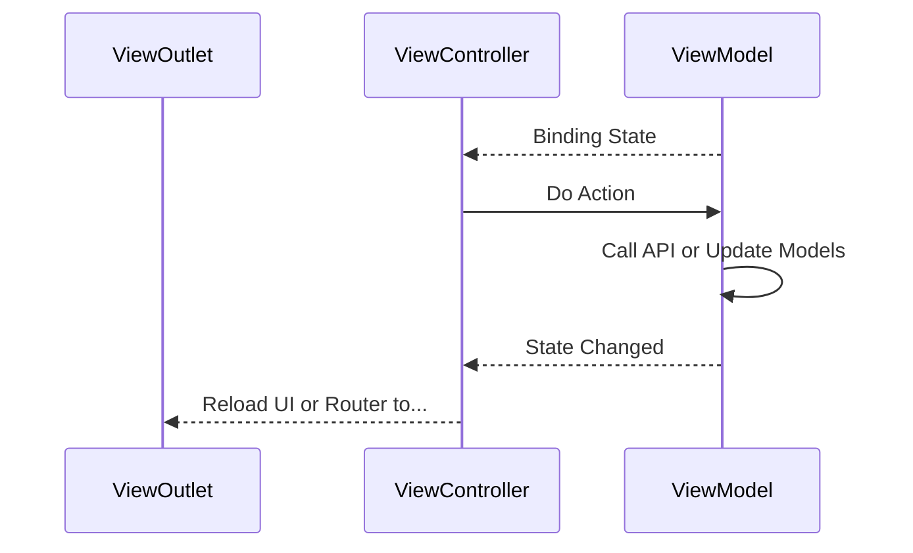

+++
title = "MVVVR 架構"
date = "2024-09-04"
[taxonomies]
tags = ["MyProject", "MVVVR"]
[extra]
mermaid = true
+++

## 前言

iOS 開發架構繁多, 從 MVC, MVVM, Rx, 到 [Clean Swift](https://clean-swift.com)...等, 最後基於 Clean Swift 實作了一個變形適合自己的架構, MVVVR.  

移除了 Clean Swift 的 Presenter / Interactor, 用 ViewModel 與 Binding State 替代.

## 說明

開發 iOS 時, 基本上都是 by UIViewController, 一個 MVVVR 模組代表一個 UIViewController 的 Life Cycle.

包含基本五個模組:

- **Model**  
  這個 ViewController 要執行的 Action / 要 Binding 的 State / 要呈現的 Model / 基礎 Raw Data.

- **ViewOutlet**  
  這個 ViewController 要呈現的 UI.

- **ViewController**  
  UIViewController 主體.

- **ViewModel**  
  這個 ViewController 的商業邏輯, 例如 call api.

- **Router**  
  這個 ViewController 的跳轉邏輯.

ViewController 持有 ViewOutlet.  
ViewController 持有 ViewModel.  
ViewController 持有 Router.  
Router 持有(Weak) ViewController.  
ViewModel 持有 Model裡的資料.

## 關係圖

ViewController Binding ViewModel 的 State, 然後由 ViewController 發起 Action,  
ViewController 再依照 ViewModel State 更新 UI.





## Demo

[Github](https://github.com/shinrenpan/MVVVR-Demo)
