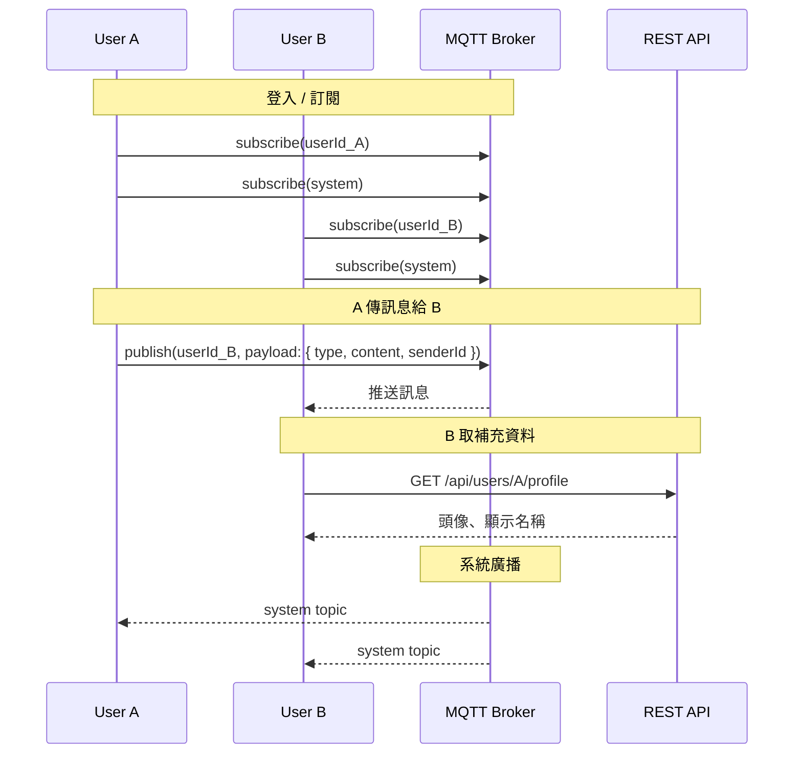

上一篇寫了 [MQTT 聊天 Demo](/2025-03-04)，這篇來聊設計思路。

MQTT 的 Pub/Sub 模型乍看只適合廣播，但只要 Topic 設計得好，點對點、群組、系統通知全部都能處理，payload 再加上 REST API 補完，一套完整的 IM 架構就出來了。



---

## Topic 設計：每個 User 訂閱兩個 Topic

```
{userId}    ← 只有你收得到
system      ← 所有人都收得到
```

登入後，每個 User 訂閱自己的 `userId` Topic 和 `system` Topic，就這樣。

**`userId` Topic** 處理所有「只給你」的事件：
- 有人傳私訊給你
- 好友上線通知
- 群組新訊息通知
- 系統通知（針對個人）

**`system` Topic** 處理廣播：
- 全站公告
- 維護通知

---

## 點對點私訊

A 傳訊息給 B：

```json
// A publish → B 的 userId Topic
{ "type": "directMessage", "senderId": "A", "content": "你好" }
```

B 訂閱了自己的 userId Topic，收到後解析 payload，顯示訊息。

---

## 好友上線通知

A 上線：

```json
// A publish → 所有好友的 userId Topic
{ "type": "presence", "senderId": "A", "status": "online" }
```

好友各自收到，更新好友清單的上線狀態。Server 不需要主動 push，完全由 A 自己廣播給好友。

---

## 群組訊息

A 在群組裡發訊息：

```json
// A publish → 群組內所有成員的 userId Topic
{ "type": "groupMessage", "senderId": "A", "roomId": "room_123", "content": "大家好" }
```

Payload 直接帶完整的訊息內容，收到就能馬上顯示，不需要多一次網路請求。

---

## REST API 負責的是輔助資料

MQTT payload 帶的是即時訊息本身，但有些資料不適合每次都塞進 payload：

- **聊天室資訊**：名稱、成員列表、設定
- **發送方資訊**：頭像、顯示名稱（不需要每則訊息都帶）
- **歷史訊息**：斷線重連後補齊的訊息（MQTT broker 不是資料庫）

這些走 REST API：

```shell
GET /api/rooms/room_123          # 聊天室資訊
GET /api/users/A/profile         # 發送方資訊
GET /api/rooms/room_123/messages # 歷史訊息
```

**MQTT 負責即時推送，REST 負責查詢輔助資料**，兩者分工明確。

---

## 小結

| 需求 | 做法 |
|---|---|
| 點對點私訊 | publish 到對方 userId Topic |
| 好友上線通知 | publish 到所有好友 userId Topic |
| 群組訊息 | publish 到所有群組成員 userId Topic |
| 系統廣播 | publish 到 system Topic |
| 聊天室資訊、發送方資訊、歷史訊息 | REST API |
| 送達保證 | MQTT QoS 2 |

兩個 Topic、自訂 Payload、REST 補完，這套組合覆蓋了大多數 IM 場景，而且比自己從頭設計 WebSocket 協定省事得多。

---

*本文使用 Claude 共同完成*
