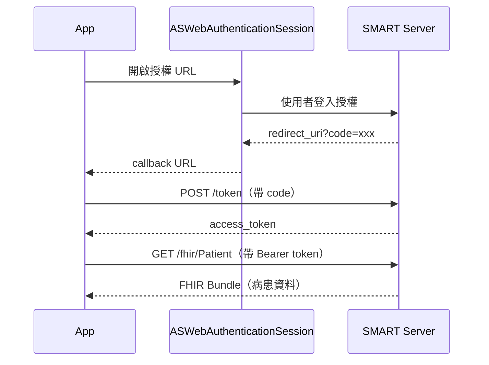

醫療系統的 App 要存取病患資料，繞不開 FHIR。這篇記錄如何用 SMART on FHIR 完成 OAuth 授權，並用 Apple 官方的 FHIRModels 套件解析回傳的資料。


---

## 什麼是 SMART on FHIR

- **FHIR**（Fast Healthcare Interoperability Resources）：HL7 制定的醫療資料交換標準，R4 是目前主流版本
- **SMART on FHIR**：在 FHIR 上套用 OAuth 2.0 的授權框架，讓第三方 App 可以安全存取醫療系統的資料

流程跟一般的 OAuth Authorization Code Flow 一樣：取得 code → 換 token → 用 token 呼叫 API。

---

## 整體流程



---

## Step 1：建立授權 URL

```swift
func makeOAuthURL() -> URL? {
    let authURI = "https://launch.smarthealthit.org/.../auth/authorize"

    guard var components = URLComponents(string: authURI) else { return nil }
    components.queryItems = [
        .init(name: "response_type", value: "code"),
        .init(name: "redirect_uri",  value: "app://"),
        .init(name: "aud",           value: "https://launch.smarthealthit.org/.../fhir"),
        .init(name: "scope",         value: "patient/*.cruds"),
    ]
    return components.url
}
```

`scope: patient/*.cruds` 代表要求對所有 Patient 資源的讀寫權限。`redirect_uri` 用自訂 scheme `app://`，授權完成後系統會把 callback URL 傳回 App。

---

## Step 2：ASWebAuthenticationSession 完成授權

```swift
// HostController 處理 Router
case let .showOAuthView(url):
    let session = ASWebAuthenticationSession(
        url: url,
        callbackURLScheme: "app"
    ) { [weak self] callbackURL, error in
        guard let self else { return }
        Task {
            if let error {
                await self.viewModel.doAction(.oauth(.failure))
            } else {
                await self.viewModel.doAction(.oauth(.success(callbackURL)))
            }
        }
    }
    session.presentationContextProvider = self
    session.start()
```

用系統瀏覽器完成授權，不在 App 內嵌入帳密，符合 OAuth 安全規範。授權完成後 callback URL 帶著 `code` 參數傳回來。

---

## Step 3：用 code 換 token

```swift
func makeTokenURLRequest(code: String) -> URLRequest? {
    var request = URLRequest(url: tokenURL)
    request.httpMethod = "POST"
    request.setValue("application/x-www-form-urlencoded", forHTTPHeaderField: "Content-Type")

    var body = URLComponents()
    body.queryItems = [
        .init(name: "grant_type",   value: "authorization_code"),
        .init(name: "code",         value: code),
        .init(name: "redirect_uri", value: "app://"),
    ]
    request.httpBody = body.query?.data(using: .utf8)
    return request
}
```

Token endpoint 用 POST + `application/x-www-form-urlencoded`，這是 OAuth 2.0 的標準格式。

---

## Step 4：用 Apple FHIRModels 解析病患資料

拿到 token 後呼叫 FHIR API，回傳的是一個 FHIR Bundle，裡面包含多筆 Patient 資源。

```swift
import ModelsR4

static func with(_ data: Data) throws -> [Patient] {
    let bundle = try JSONDecoder().decode(ModelsR4.Bundle.self, from: data)
    let patients = bundle.entry?
        .compactMap { $0.resource?.get(if: ModelsR4.Patient.self) } ?? []
    return patients.compactMap { .init(patient: $0) }
}

init(patient: ModelsR4.Patient) {
    self.id        = patient.id?.value?.string ?? UUID().uuidString
    self.name      = patient.name?.first?.given?.first?.value?.string ?? "Unknown"
    self.birthDate = patient.birthDate?.value?.description ?? "Unknown"
}
```

[Apple FHIRModels](https://github.com/apple/FHIRModels) 把整個 FHIR R4 規範都 model 化了，直接 `JSONDecoder().decode(ModelsR4.Bundle.self, ...)` 就能解析，不需要自己寫 DTO。

---

## Sandbox 設置

用 [SMART Health IT Sandbox](https://launch.smarthealthit.org/) 測試，不需要真實的醫療系統帳號，也不需要註冊 App。

### 選 Standalone Launch

Sandbox 提供兩種模式：

| 模式 | 說明 |
|---|---|
| **Standalone Launch** | 由 App 主動發起，不需要醫院 EHR 系統的 launch context |
| **Provider EHR Launch** | 從醫院內部系統跳轉過來，帶有 launch token，模擬真實醫療情境 |

Demo 用 **Standalone Launch**，流程跟一般第三方 OAuth App 相同。

### 取得 URL

1. 選 **Standalone Launch**
2. 點 **Launch**，進入登入頁面後，從瀏覽器網址列複製 URL

URL 格式如下：

```
https://launch.smarthealthit.org/v/r4/sim/xxxxx/auth/authorize?...
                                              ↑
                                        這段是 Launcher 產生的 config
```

去掉 `/auth/authorize?...` 後面的部分，Base URL 就是：

```
https://launch.smarthealthit.org/v/r4/sim/xxxxx/
```

程式碼裡的端點對應：

| 用途 | URL |
|---|---|
| Authorization | `{Base URL}auth/authorize` |
| Token | `{Base URL}auth/token` |
| FHIR API | `{Base URL}fhir` |


---

[Demo](https://github.com/shinrenpan/FhirDemo)

---

*本文使用 Claude 共同完成*
