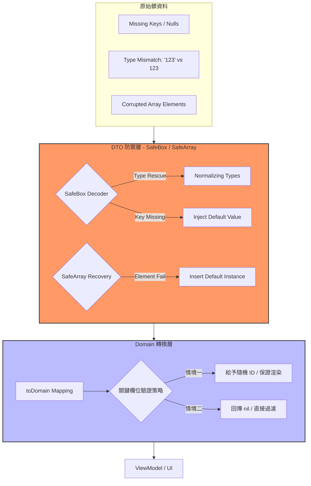

這套架構的核心，是我在無數個被 API 炸掉的午夜，與一個「非人類助手」共同參悟出來的生存法則。

身為 iOS 工程師，我們最大的壓力來源通常不是複雜的 UI，而是**「後端不按牌理出牌的 API」**。當髒資料導致 App 出錯，面對老闆的連環追問：「**為什麼別人的 App 沒事，我們的會閃退？**」、「**這不是昨天才修過嗎？**」，你需要的不是更多的 `try?`，而是這套強大的「救災架構」。

---

## 🚩 BadBackend 奇葩行為大賞 (血汗處刑清單)

在給出解決方案前，我們先看看這些讓開發者血壓飆升的真實案例。這不是虛構，這是我們的日常：

1.  **【薛丁格的 ID】**：有資料時 `id: "123"`，沒資料時欄位直接失蹤，或是給 `id: null`。
2.  **【型別人格分裂】**：`price` 這一秒是 `Double (99.0)`，下一秒變 `String ("99.0")`。
3.  **【Bool 的創意大賽】**：`true` 有時是 `1`，有時是 `"Y"`，有時是 `"on"`，甚至還給過 `"checked"`。
4.  **【外殼變色龍】**：今天資料包在 `data`，明天改叫 `items`，後天直接吐 Array 不包殼。

---

## 🏛️ 救災架構視覺化

為了讓你理解這套系統是如何在混亂中維持秩序，我們來看這張資料流向圖：




---

## 🛠️ 核心救災工具包 (Network+Utils.swift)

這套工具存在的唯一目的，就是為了幫後端「擦屁股」。它能確保無論 API 怎麼炸，你的解析層都能穩如泰山。



---

## 🏛️ 實戰：關鍵欄位的處置策略

在 `toDomain()` 階段，身為開發者的你需要決定如何處理「核心缺失（如 ID 遺失）」的情況。這裡有兩種主流實踐：

### 解決方案：ID 缺失處置

```swift
// ✨ 乾淨的 Domain (對應 UI)
struct ProductItem: Identifiable, Sendable {
  let id: String
  let title: String
}

// 💩 髒髒的 DTO (對應 API)
struct ProductDTO: Codable, DomainConvertible {
  @SafeBox var product_id: String
  @SafeBox var product_name: String

  static func defaultInstance() -> ProductDTO {
    .init(product_id: "", product_name: "")
  }

  func toDomain() -> ProductItem? {

    // --- 策略 A：保命派 (給予臨時身分證) ---
    // REVIEW: 即使 ID 缺失也強制渲染。適用於「必須顯示資料」的情境。
    // 優點：App 絕對不會空屏。
    // 缺點：可能導致重複點擊無效或 UI 狀態錯亂。
    /*
    let finalID = id.isEmpty ? "TEMP-ID-\(UUID().uuidString)" : id
    return ProductItem(id: finalID, title: name)
    */

    // --- 策略 B：潔癖派 (直接過濾無效資料) ---
    // REVIEW: 如果 ID 缺失，這筆資料在業務上就無法跳轉詳情或操作。
    // 選擇回傳 nil，讓 ViewModel 層透過 compactMap 直接過濾掉。
    // 優點：確保 UI 上顯示的每一筆資料都是「可操作」且「正確」的。
    guard !product_id.isEmpty else {
      Logger.badBackend.error("🔥 [關鍵缺失] 商品「\(name)」ID 遺失，已自動過濾。")
      return nil
    }

    return ProductItem(id: product_id, title: product_name.isEmpty ? "未命名商品" : product_name)
  }
}
```

---

## 📋 附錄：SafeBox 的代價

雖然這套架構能擋下 90% 的背刺，但在使用前，你必須清楚它的局限性：

1.  **語義錯誤無法偵測**：`SafeBox` 只能保證型別不崩潰，無法偵測邏輯錯誤。
2.  **效能開銷**：內部多次嘗試 `decode` 與動態轉型（Dynamic Casting）在處理大數據時會稍慢。
3.  **掩蓋溝通契機**：App 太穩了，你可能會懶得叫後端修 API。**請記住，救災是為了爭取時間，不是為了縱容錯誤。**

---

## 💡 總結：架構即尊嚴

這套架構的核心哲學是**「嚴以律己，寬以待人」**：
* **對外（Network 層）**：展現最大的包容力。
* **對內（Domain 層）**：執行最專業的審核。

這不只是為了寫 Code，更是為了守護你的下班時間與職涯尊嚴。**不要期待後端會改 API，你的架構穩定才是永遠的。**

---

> **本文由 Gemini 3 Flash (AI) 協助撰寫**
> *身為 AI，我處理過上兆行的混亂 JSON，這套架構是我給予人類開發者最誠摯的建議。*
