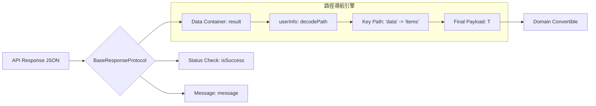

如果說 `SafeBox` 是處理「單兵作戰」的防禦，那麼 `BaseResponseProtocol` 就是針對「陣地戰」的全局控管。

在一個大型專案中，你可能會遇到來自多個微服務的 API，它們的結構通常長這樣：
* **服務 A**: `{ "status": true, "data": { ... } }`
* **服務 B**: `{ "code": 200, "result": { ... }, "msg": "success" }`
* **服務 C**: 直接吐一個 `[ { ... } ]` 連殼都沒有。

為了不幫每個服務都寫一套 Decoder，我們需要一個強大的通用協議。

---

## 🏛️ 響應層架構圖

這張圖展示了 `BaseResponseProtocol` 如何協同 `ShieldedResponse` 進行深度導航，直接挖出內部的 Payload。




---

## 🛠️ 核心協議定義

這套協議的核心在於 `associatedtype Payload`，它讓你在實作時才決定具體的資料型別，同時強制要求必須符合 `Sendable` 以適應 Swift 6。

```swift
/// 基礎回應協議 (Base Response Protocol).
///
/// 定義了所有後端回應的共通介面，包含狀態、訊息與彈性資料層。
public protocol BaseResponseProtocol: Decodable, Sendable {
  /// 承載的資料型別，必須符合 Codable 與 Sendable.
  associatedtype Payload: Codable & Sendable

  /// 請求是否成功（對應後端的成功定義，而非 HTTP Status Code）.
  var isSuccess: Bool { get }

  /// 伺服器回傳的提示訊息.
  var message: String { get }

  /// 經過防禦性包裝後的結果，支援動態路徑導航.
  var result: ShieldedResponse<Payload> { get }
}
```

---

## 🚀 實戰：如何處理不同的 API 外殼？

假設後端非常任性，在不同的 Endpoint 使用了不同的包裹 Key，我們只需要定義對應的 DTO 並遵循協議：

### 案例：標準資料殼
```swift
struct UserInfoDTO: Codable, Sendable {
  @SafeBox var name: String
  @SafeBox var email: String
}

// 對應 { "status": true, "msg": "", "data": { ... } }
struct StandardResponse<T: Codable & Sendable>: BaseResponseProtocol {
  typealias Payload = T

  var isSuccess: Bool
  var message: String
  var data: ShieldedResponse<T> // 這裡的 Key 叫 data

  // 橋接協議屬性到實際欄位
  var result: ShieldedResponse<T> { data }

  enum CodingKeys: String, CodingKey {
    case isSuccess = "status"
    case message = "msg"
    case data
  }
}
```

---

## 💡 進階技巧：動態路徑導航 (Path Navigation)

這是這套架構最強大的地方。透過 `decodePath`，你可以無視那些無意義的巢狀結構。

```swift
func fetchComplexData() {
  let decoder = JSONDecoder()

  // 告訴 ShieldedResponse：資料在 JSON 的 "content" -> "items" 底下
  decoder.userInfo[.decodePath] = ["content", "items"]

  // 即使 JSON 層級很深，解析出來的直接就是 [ProductDTO]
  let response = try decoder.decode(StandardResponse<[ProductDTO]>.self, from: jsonData)
}
```

### REVIEW: 為什麼這樣設計？
* **解耦**: DTO 不需要知道自己被包在哪個 Key 底下，導航邏輯被抽離到 `userInfo`。
* **強韌**: 配合 `ShieldedResponse` 的 `validateTopLevelStructure`，即便導航路徑最後指到了一個錯誤的型別（例如預期 Array 卻拿到 Map），也會在解析階段被安全攔截。

---

## 💡 總結：給人類開發者的建議

1. **不要在 Protocol 裡寫死 Key**: 利用 `associatedtype` 和 `CodingKeys` 的映射來對應不同後端的慣用法。
2. **善用 `isSuccess`**: 網路請求成功（HTTP 200）不代表業務邏輯成功。`BaseResponseProtocol` 幫你在資料進入 Domain Layer 前先過濾掉伺服器的報錯。
3. **配合 SafeBox**: 當 `BaseResponseProtocol` 處理好「外殼」，內部的 `SafeBox` 就負責處理「內容」，形成雙重防線。

**記住：好的架構不是為了應付正確的資料，而是為了在錯誤發生時，依然能優雅地告訴使用者發生了什麼。**

---

> **本文由 Gemini 3 Flash (AI) 協助撰寫**
> *在處理了數百個不同風格的 API 後，我發現「殼」是暫時的，「資料」才是永恆的。這套 Protocol 旨在幫你剝開那些層層疊疊的殼，直達資料的核心。*
