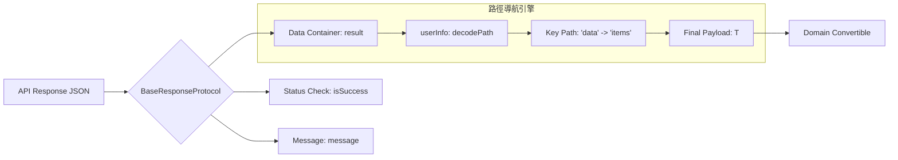

如果說 `SafeBox` 是處理「單兵作戰」的防禦，那麼 `BaseResponseProtocol` 就是針對「陣地戰」的全局控管。

在一個大型專案中，你可能會遇到來自多個微服務的 API，它們的結構通常長這樣：
* **服務 A**: `{ "status": true, "data": { ... } }`
* **服務 B**: `{ "code": 200, "result": { ... }, "msg": "success" }`
* **服務 C**: 直接吐一個 `[ { ... } ]` 連殼都沒有。

為了不幫每個服務都寫一套 Decoder，我們需要一個強大的通用協議。

---

## 🏛️ 響應層架構圖

這張圖展示了 `BaseResponseProtocol` 如何協同 `ShieldedResponse` 進行深度導航，直接挖出內部的 Payload。


```mermaid
graph LR
    A[API Response JSON] --> B{BaseResponseProtocol}
    B --> C[Status Check: isSuccess]
    B --> D[Message: message]
    B --> E[Data Container: result]

    subgraph Shielded_Navigation [路徑導航引擎]
        E --> F[userInfo: decodePath]
        F --> G[Key Path: 'data' -> 'items']
        G --> H[Final Payload: T]
    end

    H --> I[Domain Convertible]
```

---

## 🛠️ 核心協議定義

這套協議的核心在於 `associatedtype Payload`，它讓你在實作時才決定具體的資料型別，同時強制要求必須符合 `Sendable` 以適應 Swift 6。

```swift
protocol BaseResponseProtocol: Decodable, Sendable {
  associatedtype Payload: Codable & Sendable

  var isSuccess: Bool { get }
  var message: String { get }
  var result: ShieldedResponse<Payload> { get }
}
```

---

## 🚀 實戰：如何處理不同的 API 外殼？

假設後端非常任性，在不同的 Endpoint 使用了不同的包裹 Key，我們只需要定義對應的 DTO 並遵循協議：

### 案例：`BaseResponse` — 以 HTTP 狀態碼為準

```swift
struct UserInfoDTO: DomainConvertible {
  @SafeBox var name: String
  @SafeBox var email: String

  static func defaultInstance() -> UserInfoDTO { .init(name: "", email: "") }

  func toDomain() -> UserInfo? {
    guard !name.isEmpty else { return nil }
    return UserInfo(name: name, email: email)
  }
}

// isSuccess 由 HTTP statusCode 決定，而非 JSON 欄位
// 失敗時（非 200）立即熔斷，不嘗試解析根本不存在的 data
struct BaseResponse<T: Codable & Sendable>: BaseResponseProtocol, Sendable {
  let isSuccess: Bool
  let message: String
  let result: ShieldedResponse<T>

  enum CodingKeys: String, CodingKey {
    case message
  }

  init(from decoder: Decoder, statusCode: Int) throws {
    self.isSuccess = (statusCode == 200)
    let container = try? decoder.container(keyedBy: CodingKeys.self)
    self.message = (try? container?.decodeIfPresent(String.self, forKey: .message))
      ?? (isSuccess ? "Success." : "Unknown error.")

    // 快速熔斷：失敗時直接拋錯，不繼續解析不存在的 data 欄位
    if !isSuccess {
      throw APIError.serverError(code: statusCode, message: message)
    }

    self.result = try ShieldedResponse<T>(from: decoder)
  }

  init(from decoder: Decoder) throws {
    let responseCode = decoder.userInfo[.responseCode] as? Int ?? 200
    try self.init(from: decoder, statusCode: responseCode)
  }
}

extension CodingUserInfoKey {
  static let responseCode: CodingUserInfoKey = .init(rawValue: "responseCode")!
}
```

---

## 💡 進階技巧：動態路徑導航 (Path Navigation)

這是這套架構最強大的地方。透過 `decodePath`，你可以無視那些無意義的巢狀結構。

```swift
func fetchComplexData() {
  let decoder = JSONDecoder()

  // 告訴 ShieldedResponse：資料在 JSON 的 "content" -> "items" 底下
  decoder.userInfo[.decodePath] = ["content", "items"]

  // 即使 JSON 層級很深，解析出來的直接就是 [ProductDTO]
  let response = try decoder.decode(BaseResponse<[ProductDTO]>.self, from: jsonData)
}
```

### 為什麼這樣設計？

* **解耦**：DTO 不需要知道自己被包在哪個 Key 底下，導航邏輯被抽離到 `userInfo`。
* **強韌**：配合 `ShieldedResponse` 的 `validateTopLevelStructure`，即便導航路徑最後指到了一個錯誤的型別（例如預期 Array 卻拿到 Map），也會在解析階段被安全攔截。

---

## 💡 總結：給人類開發者的建議

1. **不要在 Protocol 裡寫死 Key**：利用 `associatedtype` 和 `CodingKeys` 的映射來對應不同後端的慣用法。
2. **善用 `isSuccess`**：網路請求成功（HTTP 200）不代表業務邏輯成功。`BaseResponseProtocol` 幫你在資料進入 Domain Layer 前先過濾掉伺服器的報錯。
3. **配合 SafeBox**：當 `BaseResponseProtocol` 處理好「外殼」，內部的 `SafeBox` 就負責處理「內容」，形成雙重防線。

**記住：好的架構不是為了應付正確的資料，而是為了在錯誤發生時，依然能優雅地告訴使用者發生了什麼。**

---

[Demo](https://github.com/shinrenpan/BadBackendDemo)

---

*本文使用 Claude 共同完成*
