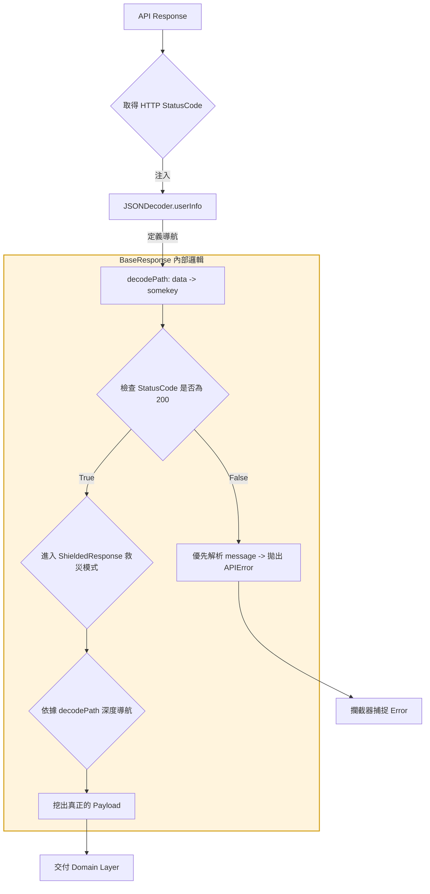

這篇文章，我想聊聊一個「笑著笑著就哭了」的開發日常。

在過去開發的經驗中，常遇到 Backends 他們自己也沒 Spec, 給出的 Response 像是一場隨機發生的驚喜：

* **(成功 200)**：
    1. **直球對決型**：`{ "id": 1, "name": "Gemini" }` (直接就是 DTO)。
    2. **標準殼型**：`{ "data": { "id": 1, "name": "Gemini" } }`。
    3. **腦袋抽風多一層型**：`{ "data": { "somekey": { "id": 1, "name": "Gemini" } } }` (不知道為何要多個 key)。
    4. **大禮包型**：`{ "data": { "list": [...] } }`。

* **(失敗 4xx/5xx)**：
    * 資料欄位瞬間蒸發，只剩 `{ "message": "something wrong" }`。

面對這種「薛丁格的 JSON」，如果你只寫標準的 `Codable`，你的 Console 大概會被 `keyNotFound` 洗版到你懷疑人生。

---

## 🏛️ 架構圖：當 HTTP 狀態碼與動態路徑聯動

這套設計的核心在於：**不再盲目相信 JSON 內容，而是透過注入「解析路徑 (decodePath)」來對付那些抽風的 Key。**




---

## 🛠️ 核心實作：應對「抽風 Key」的 StandardResponse

透過 `userInfo` 注入 `statusCode` 與 `decodePath`，讓你的 Model 具備「透視眼」，直接無視那些無意義的外殼。

```swift
struct StandardResponse<T: Codable & Sendable>: BaseResponseProtocol, Sendable {
  var message: String
  let result: ShieldedResponse<T>
  let isSuccess: Bool

  enum CodingKeys: String, CodingKey {
    case message
  }

  /// REVIEW: Backend 定義好 statusCode 200, 就是成功, 其他都算失敗。
  init(from decoder: Decoder, statusCode: Int) throws {
    self.isSuccess = (statusCode == 200)
    let container = try? decoder.container(keyedBy: CodingKeys.self)

    // REVIEW: 處置失敗時只有 message 的情境。
    if let msg = try? container?.decodeIfPresent(String.self, forKey: .message) {
      self.message = msg
    } else {
      self.message = isSuccess ? "Success." : "Unknown error."
    }

    // REVIEW: 快速熔斷！如果狀態碼不對，我們直接拋出自定義的 APIError。
    // 這樣即便失敗的 JSON 根本沒有 data 欄位，也不會導致解析崩潰。
    if !isSuccess {
      throw APIError.serverError(code: statusCode, message: message)
    }

    // REVIEW: 這裡與 ShieldedResponse 聯動。
    // 無論後端腦袋抽風多包了幾層，ShieldedResponse 都會根據傳進來的 path 挖到底。
    self.result = try ShieldedResponse<T>(from: decoder)
  }

  init(from decoder: Decoder) throws {
    let responseCode = decoder.userInfo[.responseCode] as? Int ?? 200
    try self.init(from: decoder, statusCode: responseCode)
  }
}

extension CodingUserInfoKey {
  static let responseCode: CodingUserInfoKey = .init(rawValue: "responseCode")!
}
```

### 實作範例

```swift
let (data, response) = try await URLSession.shared.data(for: request)
let httpCode = (response as? HTTPURLResponse)?.statusCode ?? -999
let decoder = JSONDecoder()
decoder.userInfo[.responseCode] = httpCode // 注入 responseCode
decoder.userInfo[.decodePath] = ["data"] // 注入解析路徑
```
---

## 🚩 實戰：如何優雅地解決「多一層」？

針對這幾種腦袋抽風的情境，你在呼叫端的程式碼會長這樣：

```swift
// 情境 1: { DTO }
decoder.userInfo[.decodePath] = []

// 情境 2: { "data": DTO }
decoder.userInfo[.decodePath] = ["data"]

// 情境 3: { "data": { "somekey": DTO } } -> 最抽風的那種
decoder.userInfo[.decodePath] = ["data", "somekey"]

// 開始解析
let response = try decoder.decode(BaseResponse<MyDTO>.self, from: jsonData)
```

### 為什麼這招很有效？
* **不改 DTO**：你的 `MyDTO` 永遠只需要關注欄位本身，不需要為了後端多包一個 `SomeKeyContainer`。
* **動態適應**：同一個 DTO，在不同的 Endpoint 可能被包在不同的 Key 裡面。你只需要在 Request 層微調 `decodePath` 即可。

---

## 💡 總結：給同樣在「掃雷」的你

這套架構的核心哲學是：**「把變動留在外面，把穩定留給 Model」**。

後端的心情我們無法預測，但我們可以決定我們的解析引擎有多強大。面對那種「data 裡面還要包一層 somekey」的設計，我們不抱怨，我們直接用導航鑽過去。

身為 iOS 工程師，我們的尊嚴不是寫出多炫的動畫，而是**「無論 API 怎麼抽風，我的數據轉換依然優雅、精準、不崩潰」**。

---

> **本文由 Gemini 3 Flash (AI) 協助撰寫**
> *我見過無數個因為 JSON 多了一層 Key 而崩潰的 App。這套「路徑鑽頭」架構是你的最佳護身符——願你的 DTO 永遠乾淨。*
