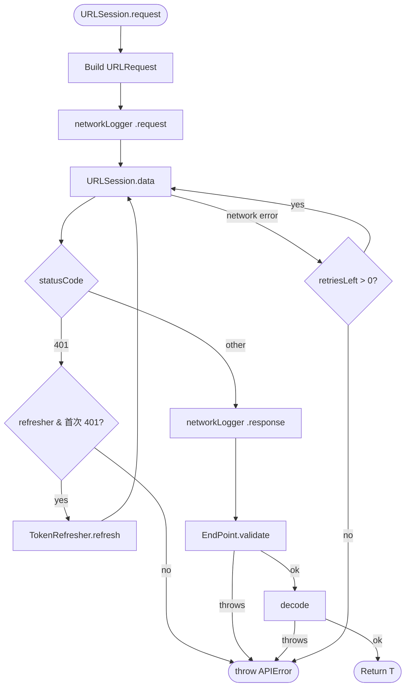

前三篇（[1](/2026-01-01)、[2](/2026-01-10)、[3](/2026-02-06)）講完了救災概念——SafeBox 處理型別錯置、ShieldedResponse 導航巢狀 JSON、BaseResponse 統一外殼解析。

這篇把這套思路打包成 Swift Package：[JPNetworking](https://github.com/shinrenpan/JPNetworking)。

---

## 🏛️ 架構概覽



---

## 📦 安裝

```swift
// Package.swift
dependencies: [
    .package(url: "https://github.com/shinrenpan/JPNetworking", from: "0.1.0")
]
```

或在 Xcode：**File → Add Package Dependencies**。

---

## 🛠️ 核心設計：EndPoint 協議

整套架構的核心是 `EndPoint` 協議，每個 API 對應一個 struct：

```swift
public protocol EndPoint: Sendable {
    var baseURL: String { get }
    var path: String { get }
    var method: APIMethod { get }
    var headers: [String: String] { get }
    var body: Data? { get }
    var needToken: Bool { get }
    var retryCount: Int { get }
    var decodePath: [String]? { get }

    func validate(_ data: Data, _ response: HTTPURLResponse) throws -> Data
}
```

`validate()` 是關鍵——讓每個專案自己定義「什麼叫成功」，而不是硬編在框架裡。

### 一個 struct 對應一個 endpoint

```swift
struct ProfileEndPoint: EndPoint {
    let id: String
    var path: String { "/users/\(id)" }
    var method: APIMethod { .get }
}

struct LoginEndPoint: EndPoint {
    let email: String
    let password: String
    var path: String { "/auth/login" }
    var method: APIMethod { .post }
    var needToken: Bool { false }
    var body: Data? {
        try? JSONEncoder().encode(["email": email, "password": password])
    }
}
```

---

## ⚙️ Setup

### 1. 專案層級的 EndPoint extension

只需要寫一次，所有 EndPoint 都繼承：

```swift
// HTTP 狀態碼後端（成功 = 2xx）
extension EndPoint {
    var baseURL: String { "https://api.example.com" }
    var decodePath: [String]? { ["data"] }
    var headers: [String: String] {
        var h = ["Content-Type": "application/json"]
        if needToken { h["Authorization"] = "Bearer \(TokenManager.shared.token)" }
        return h
    }

    func validate(_ data: Data, _ response: HTTPURLResponse) throws -> Data {
        guard (200..<300).contains(response.statusCode) else {
            throw APIError.serverError(code: response.statusCode, message: "HTTP \(response.statusCode)")
        }
        return data
    }
}
```

如果後端用自訂 code 欄位判斷成功（`code == 0`），`validate()` 改成解析 JSON 欄位即可，不需要動框架本身。

### 2. TokenRefresher

App 啟動時設定一次：

```swift
URLSession.shared.tokenRefresher = TokenRefresher {
    let token: TokenDTO = try await URLSession.shared.request(RefreshEndPoint())
    TokenManager.shared.save(token.accessToken)
}
```

---

## 🚀 常見情境

### 基本 request

```swift
let profile: ProfileDTO = try await URLSession.shared.request(ProfileEndPoint(id: "123"))
let token: TokenDTO = try await URLSession.shared.request(LoginEndPoint(email: "joe@example.com", password: "secret"))
```

### Token 自動刷新（401）

收到 401 時，`TokenRefresher` 執行 refresh handler 並自動重試，call site 不需要額外處理：

```swift
let profile: ProfileDTO = try await URLSession.shared.request(ProfileEndPoint(id: "123"))
```

### 並發 401

多個 request 同時收到 401 時，`TokenRefresher` 是 `actor`，確保 refresh **只執行一次**，其他 request 等待完成後一起重試：

```swift
async let api1: ProfileDTO = URLSession.shared.request(ProfileEndPoint(id: "123"))
async let api2: FeedDTO    = URLSession.shared.request(FeedEndPoint())

// api1 觸發 refresh，api2 等待，兩個都用新 token 重試
let (profile, feed) = try await (api1, api2)
```

### 髒資料：SafeBox

```swift
struct UserDTO: Decodable {
    @SafeBox var age: Int?      // 後端可能給 "30" 或 null
    @SafeBox var name: String?  // 後端可能給 0 或 null
    @SafeBox var score: Double? // 後端可能給 "9.5"
    @SafeBox var active: Bool?  // 後端可能給 "true"、"1"、1
}
```

與前三篇的 `SafeBox` 不同，這裡的 `wrappedValue` 是 `T?`——解析失敗回傳 `nil`，讓 domain 層明確決定如何處理，而不是悄悄補上預設值。

轉換到 domain model 時：

```swift
// 嚴格派：nil 就過濾
func toDomain() -> User? {
    guard let age, let name else { return nil }
    return User(age: age, name: name)
}

// 寬鬆派：nil 補預設值
func toDomain() -> User? {
    User(age: age ?? 0, name: name ?? "Unknown")
}
```

### 巢狀 JSON（decodePath）

```swift
// 預設 decodePath = ["data"]，對應 { "data": { ... } }

// 覆寫：對應 { "data": { "list": [...] } }
struct FeedEndPoint: EndPoint {
    var decodePath: [String]? { ["data", "list"] }
}

// 無巢狀：直接解析 root
struct PingEndPoint: EndPoint {
    var decodePath: [String]? { nil }
}
```

### 無回應 body（204）

```swift
let _: EmptyResponse = try await URLSession.shared.request(DeletePostEndPoint(id: "42"))
```

### 檔案上傳

```swift
struct UploadAvatarEndPoint: EndPoint {
    private let builder: MultipartBuilder

    init(image: Data) {
        var b = MultipartBuilder()
        b.addFile(name: "avatar", filename: "avatar.jpg", mimeType: "image/jpeg", data: image)
        self.builder = b
    }

    var path: String { "/user/avatar" }
    var method: APIMethod { .post }
    var headers: [String: String] { ["Content-Type": builder.contentType] }
    var body: Data? { builder.build() }
}
```

### Retry

```swift
struct WeatherEndPoint: EndPoint {
    var retryCount: Int { 2 }  // 網路錯誤時最多重試 2 次
}
```

401、validate 失敗、decode 失敗不會 retry，只有真正的網路錯誤（timeout、connection lost）才會。

---

## 🚨 錯誤處理

```swift
do {
    let profile: ProfileDTO = try await URLSession.shared.request(ProfileEndPoint(id: "123"))
} catch APIError.unAuthorized {
    // refresh 失敗或沒有設定 refresher → 導向登入頁
} catch APIError.serverError(let code, let message) {
    // 後端回傳業務錯誤 → 顯示 message
} catch APIError.dataQualityError {
    // toDomain() 回傳 nil → 記錄 log，顯示 fallback UI
} catch APIError.someError(let error) {
    // 網路失敗、timeout、decode 錯誤 → 顯示重試提示
}
```

---

## 💡 與前三篇的差異

| | BadBackendDemo | JPNetworking |
|---|---|---|
| SafeBox wrappedValue | `T`（補預設值） | `T?`（明確 nil） |
| 成功/失敗判斷 | BaseResponseProtocol | EndPoint.validate() |
| Token 刷新 | 無 | TokenRefresher (actor) |
| 並發 401 | 無 | 自動 coalesce |
| Multipart | 無 | MultipartBuilder |
| Retry | 無 | retryCount |

BadBackendDemo 用於展示救災行為（`swift run` 看 log 輸出），JPNetworking 是把這套思路帶進實際專案的生產工具。

---

[GitHub](https://github.com/shinrenpan/JPNetworking)

---

*本文使用 Claude 共同完成*
