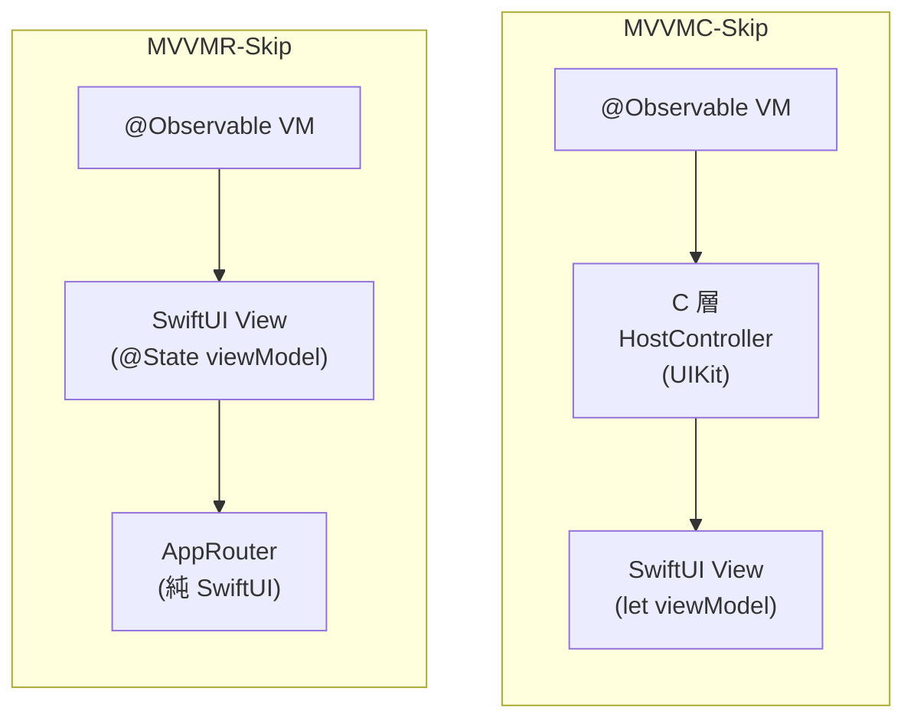

前陣子寫了兩件事：先用 [Skip](https://skip.tools) 把 **MVVMC** 帶上 Android（[MVVMC-Skip 三部曲](/2026-06-26/)），後來又把 MVVMC 用純 SwiftUI 重寫成 **MVVMR**（C/Controller → R/Router，[那一篇在這](/2026-06-28/)）。

寫完 MVVMR，一個念頭就冒出來了：

> MVVMC 上 Skip 我已經知道會踩哪些坑了。那 **MVVMR 上 Skip** 呢？同樣的 M/VM/V，少了 UIKit 的 C 層，是會更輕鬆、還是換一批新坑？

於是又開了一個實驗專案把它做完、兩個平台都跑起來。結論比我預期的乾淨：**踩到的坑幾乎一模一樣，但 MVVMR 整體成本更低**，而且兩邊所有的差異，最後都能收斂到**同一條邊界**上：View 是用 `@State` 自己持有 ViewModel，還是用 `let` 由別人持有。

這篇就講這個。

---

## 🏛️ 先對齊：兩邊到底差在哪

Skip 做的事很單純：把 Swift 轉譯成 Kotlin/Compose，原始碼就是唯一依據。所以「上 Skip 會踩什麼坑」，本質上就是「你的程式碼有多少地方 Skip 的轉譯器吃不下」。

MVVMC-Skip 跟 MVVMR-Skip 共用**完全一樣的 M / VM / V**：

- `@Observable @MainActor` 的 ViewModel、單一 `doAction` 進入點
- 一樣的 `Action` enum、一樣的 `onRoute` / `onCallback` 意圖紀律
- 一樣的 SwiftUI View

唯一的差別在導航的執行底座：



MVVMC 的 View 拿到的是 `let viewModel`，`@State` 由 C 層（`UIHostingController`）持有；MVVMR 把 C 層拿掉，View 自己 `@State private var viewModel`，導航交給一個 `@Environment` 注入的 `AppRouter`。

記住這條「`let` 還是 `@State`」的差別，等一下整篇的高潮都在這。

---

## 🧱 第一塊：一樣的坑、一樣的修

把 MVVMR 丟進 Skip 的轉譯關卡，撞到的牆**幾乎可以跟 MVVMC-Skip 的清單逐條對上**，因為這些坑出在共用的 M/VM/V，跟有沒有 UIKit 無關：

| Skip 吃不下的寫法 | 修法 | MVVMC-Skip | MVVMR-Skip |
|---|---|---|---|
| 巢狀 case 解構 | 拆成外層比對 + 內層 `switch` | ✅ | ✅ |
| 從 VM 外面引用巢狀的 `ViewAction` | 補完整型別路徑 `.view(VM.ViewAction.x)` | ✅ | ✅ |
| `.init(id:)` 省略型別，悄悄掉成 Kotlin `Any` | 寫成 `User(id:)` | ✅ | ✅ |
| `ContentUnavailableView` SkipUI 還沒有 | `#if !SKIP` + 純 `VStack` 替代 | ✅ | ✅ |
| `.contentShape(Rectangle())` SkipUI 還沒有 | `#if !SKIP`（Compose 本來就整塊可點） | ✅ | ✅ |

舉個實際的，`PostListView` 裡這段 iOS / Android 都共用，`#if !SKIP` 包住 SkipUI 還沒實作的 API：

```swift
case let .error(message):
    #if !SKIP
    ContentUnavailableView(message, systemImage: "exclamationmark.triangle")
    #else
    // SkipUI 還沒有 ContentUnavailableView；Android 用純 VStack 替代
    VStack(spacing: 8) {
        Image(systemName: "exclamationmark.triangle")
        Text(message)
    }
    #endif
```

這塊沒什麼驚喜。**共用的程式碼長一樣，坑就長一樣，修法也長一樣**。重點是它當鋪陳：它證明了兩個實驗站在同一個起跑線上，接下來的差異才有意義。

---

## 📉 第二塊：MVVMR 整體成本更低

差異從這裡開始。MVVMC-Skip 為了維持「iOS 架構零破壞」，在 UIKit 那層付出的代價，到了 MVVMR **直接消失**，因為那層根本不存在了：

- **6 個 `*HostController.swift` + 4 個 App 層檔案，整檔 `#if !SKIP` 包起來**。
  MVVMC 的 HostController 帶著 UIKit 繼承、`super.init(rootView:)` 這種 Kotlin 沒有對應的東西，只能整檔對 Skip 隱形。MVVMR 沒有 HostController，**這 10 個 `#if !SKIP` 全部不用寫**。
- **`nonisolated(unsafe)` 全域變數**。MVVMC 的 `AppRouter` 用 associated object 存 UIKit 轉場樣式，Swift 6 的嚴格並行檢查逼著要 `nonisolated(unsafe)`。MVVMR 的 `AppRouter` 是純 SwiftUI 狀態機，沒有 associated object，**這個洞不存在**。
- **HostController 閉包裡的 `[weak]` 要改強引用**。Kotlin 是 GC 不是 ARC，MVVMC 的 HostController 閉包裡 `[weak]` 會被提早回收，得改強引用。MVVMR 沒有那批閉包，**這個雷踩不到**。

換句話說，MVVMC-Skip 的遷移成本裡，有一整類是「為了讓 UIKit 底座跟 Skip 共存」付的稅。MVVMR 把底座換成純 SwiftUI 之後，**這類稅整批歸零**。

---

## 🎯 第三塊：「`@State` 還是 `let`」的雙向效應

這才是這篇最想講的。

同樣的 Skip（1.9.3）、同樣的 M/VM/V，兩邊**唯一**的結構差異就是 View 怎麼持有 VM。神奇的是，這一條差異同時往**兩個相反方向**各踢了一腳：一腳害 MVVMR，一腳幫 MVVMR。

### 害到 MVVMR：閉包裡的 `ViewAction` 被改寫

`PostList` 的每一列要送出兩個動作（點 post、點 user）。最直覺的寫法是直接在 `PostRow` 的閉包裡呼叫：

```swift
PostRow(post: post) {
    Task { await viewModel.doAction(.view(PostListViewModel.ViewAction.postDidTap(post))) }
}
```

這段在 **MVVMC-Skip 編得過**，到 **MVVMR-Skip 卻編不過**。Skip 會把這個傳進去的閉包裡、帶完整型別的 `PostListViewModel.ViewAction` 引用，改寫成 `MainActor.run { PostListViewModel }`，Kotlin 那邊直接掛掉。

修法是把帶型別的動作提到外層 `List` 那一列當區域變數，閉包只引用那個變數：

```swift
List(viewModel.state.posts) { post in
    // 帶型別的動作要在這裡先建好（不要寫在 PostRow 的閉包裡）：閉包裡那個帶完整型別的
    // PostListViewModel.ViewAction 引用，會被 Skip 改寫成 MainActor.run { PostListViewModel } 而編不過。
    // 提成區域變數後，閉包就乾淨了。
    let tapAction: PostListViewModel.ViewAction = .postDidTap(post)
    let userTapAction: PostListViewModel.ViewAction = .userDidTap(post.userId)
    PostRow(post: post) {
        Task { await viewModel.doAction(.view(tapAction)) }
    } onUserTap: {
        Task { await viewModel.doAction(.view(userTapAction)) }
    }
}
```

> 一開始我以為是 `@MainActor` 閉包標註的問題，試了才確認**不是**。同樣的原始碼，MVVMC 的 `let viewModel` 版本過、MVVMR 的 `@State` 版本不過。差別就在 View 持有 VM 的方式，連帶讓 Skip 對這個閉包的轉譯走了不同的路。

### 幫到 MVVMR：`.task` 在 Android 直接動

反過來這一腳就香了。MVVMC-Skip 為了讓資料流跑得起來，所有跨平台 View 裡的 `.task` 都得拆成兩半：iOS 用 `.task`，Android 改用 `.onAppear` 包一個 `Task`，因為 `.task` 在 Android 那邊會卡在 `.loading` 上不去：

```swift
// MVVMC-Skip：.task 在 Android 會卡住，必須拆成兩半
#if !SKIP
.task { await viewModel.doAction(...) }
#else
.onAppear { Task { await viewModel.doAction(...) } }
#endif
```

不只如此，MVVMC-Skip 還得在 HostController 的 `#else` 分支補一個自己持有 `@State` 的小 struct，不然 `@Observable` 的狀態變動根本到不了 Compose，因為 View 拿的是 `let`，沒人持有 `@State`，Compose 的 `trackState()` 不會被裝上去。

MVVMR 完全不用這些。因為 View **自己**就 `@State private var viewModel`，`@Observable` 到 Compose 重繪的橋自然就接上了，`.task` 在 Android 跟 iOS 一樣正常觸發：

```swift
// MVVMR-Skip：一行就好，兩平台通用
.task {
    await viewModel.doAction(.view(PostListViewModel.ViewAction.isFirstAppear))
}
```

那個自己持有 `@State` 的小 struct、那個 `.task` 拆兩半，**MVVMR 一條都不用**。

### 同一條邊界，兩個方向

把這兩腳放在一起看就很漂亮：

| | MVVMC-Skip（View 拿 let） | MVVMR-Skip（View 拿 @State） |
|---|---|---|
| 閉包裡的 `ViewAction` | ✅ 編得過 | ❌ 要提成區域變數 |
| `.task` 在 Android | ❌ 要拆兩半 + 補 `@State` 小 struct | ✅ 一行直接動 |

**誰持有 `@State`** 這一個決定，同時決定了這兩件事的走向，而且方向相反。這不是兩個獨立的坑，是同一條邊界的一體兩面。

---

## 💡 總結

把 MVVMR 帶上 Skip，回答了當初那個念頭：

1. **共用的 M/VM/V → 共用的坑、共用的修法**。這部分跟 MVVMC-Skip 逐條對得上，沒有意外。
2. **少了 UIKit C 層 → 一整類「底座稅」歸零**：10 個 `#if !SKIP` 整檔包、`nonisolated(unsafe)`、`[weak]` 的 GC 問題，全部不用付。**MVVMR 上 Skip 整體成本更低。**
3. **所有剩下的差異收斂在「`@State` 還是 `let`」**：這條 VM 持有方式的邊界同時害到、也幫到 MVVMR，方向相反但根源同一。

最有意思的是第三點。它其實反過來幫 MVVMR 的純 SwiftUI 設計做了個側面背書：當你讓 View 直接持有 `@Observable` VM、走 SwiftUI 原生的持有方式，跨平台時連 `.task` 都不用特別處理；而為了相容 UIKit 而把 `@State` 託管出去的代價，會在轉譯成 Compose 時以另一種形式冒出來。

架構沒有絕對的對錯，但「資料流走不走原生路徑」這件事，會在你意想不到的地方（比如轉譯成另一個平台時）回頭找你。

---

完整的實驗專案（含 iOS / Android 兩平台、每個坑的 migration log）都在這：[github.com/shinrenpan/MVVMR-Skip](https://github.com/shinrenpan/MVVMR-Skip)。

*本文使用 Claude 共同完成*
