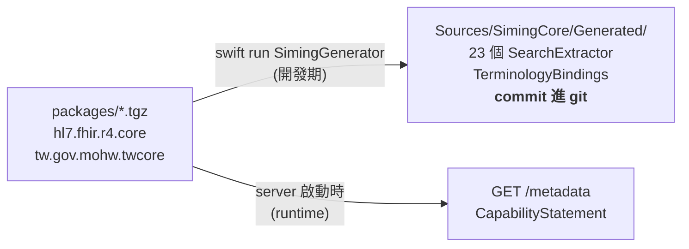

台灣的診所資訊系統如果要跟上 FHIR（醫療資料交換標準），第一個撞到的現實是：業界預設的 server 是 [HAPI FHIR](https://hapifhir.io)——一頭 JVM 巨獸，image 幾百 MB、啟動要一分鐘、吃資源不手軟。對醫學中心無所謂，對一間小診所的自架環境，這個門檻高得很沒必要。

所以我開了一個實驗專案：**用 server-side Swift 寫一台 FHIR R4 server**，目標很明確——資源需求更低、原生支援台灣的 TW Core IG、一行指令部署，先瞄準小診所。

專案叫 **Siming（司命）**——掌生死簿的神，管臨床資料剛好對口。這篇講三件事：技術選型、benchmark 結果，以及整個專案我認為最值錢的一個設計決定：**search 不是手寫的**。

---

## 🧰 技術選型：把 Swift 當一門正經的後端語言用

| 層 | 選擇 | 為什麼 |
|---|---|---|
| HTTP framework | [Hummingbird 2](https://github.com/hummingbird-project/hummingbird)（SwiftNIO） | 輕量、現代 concurrency 原生，不揹 Vapor 的全家桶 |
| DB | [PostgresNIO](https://github.com/vapor/postgres-nio) 直連 | **不用 ORM**，手寫 SQL，效能路徑全部自己掌握 |
| FHIR models | [apple/FHIRModels](https://github.com/apple/FHIRModels) | Apple 官方維護的 FHIR 型別，`Codable` 直接編解碼 |

「不用 ORM」不是炫技，是這個領域的必然：FHIR 的 search 語意（token、chained search、`_has`、`_include`、quantity 的 `ap` 前綴……）沒有任何 ORM 表達得出來，與其跟 ORM 搏鬥不如直接寫 SQL，把資源型別的欄位抽進五張 `idx_*` 索引表。

做出來的能力清單：23 種 FHIR R4 resource 的 CRUD / search / history / compartment / transaction bundle、TW Core IG v1.0.0 九個 profile 全數通過驗證、SMART on FHIR JWT、內建 resource browser（`GET /ui`）、Prometheus metrics。部署是一行 `bash scripts/setup.sh`。

---

## 📊 Benchmark：跟 HAPI 正面對決

Release build、5,000 筆 patient、兩邊都跑 PostgreSQL，同機對打：

| 情境 | Siming | HAPI FHIR | 倍率 |
|---|---|---|---|
| `GET /Patient/:id` | 15,515 RPS | 6,883 RPS | **2.25×** |
| `GET /Patient?name=Wang` | 2,512 RPS | 1,627 RPS | **1.54×** |

數字漂亮，但老實說這不是重點——HAPI 揹著十幾年的功能包袱，Siming 只做臨床資料的核心路徑，贏它本來就該的。真正的意義是**證明 server-side Swift 在這個量級完全站得住**：SwiftNIO 的 event loop + 編譯後的原生碼 + 手寫 SQL，讓一台小診所等級的機器就能跑出這種吞吐。

---

## 🏰 護城河：search 是 generate 出來的，不是手寫的

這是整個專案最核心的一個設計決定。

FHIR server 最大的維護噩夢是 **search parameter**：每種 resource 有幾十個 search param，每個都要「從 resource 的某個路徑抽值 → 寫進正確的索引表」。手寫的話，23 種 resource 就是幾百段長得很像又不能複製貼上的抽取碼；而且 IG（Implementation Guide）一改版，全部重來。

Siming 的做法：**這些程式碼全部由 `SimingGenerator` 從 FHIR package 產生**。



同一份 `packages/*.tgz` 有兩個消費者，跑在不同時間點：

- **Search extractor 是編譯期產物。** 它們是型別安全的 Swift、活在寫入的熱路徑上，所以被編成機器碼，而且 **commit 進 git**——可以 review、可以 diff。
- **CapabilityStatement 是 runtime 產物。** server 啟動時從同一批 package 建出來，所以 `/metadata` 永遠反映實際載入的 IG。

這帶來的 headline property 是：

> **換 IG = 換一個 package + 重新 generate。不改任何 handler。**

TW Core IG 從 1.0 升 2.0？把新的 `.tgz` 丟進 `packages/`、跑一次 generator、review `Generated/` 底下的 diff——新增或移除的 search param 會以普通程式碼變更的形式出現在 code review 裡。handler 一行都不用動。

配套的紀律只有一條鐵律：**generated code 永遠不准手改**。生成的檔案有錯，就去修 generator 或修輸入的 package。每個生成檔案的檔頭都印著出處：

```swift
// GENERATED — do not edit directly.
// Source: packages/*.tgz (hl7.fhir.r4.core + tw.gov.mohw.twcore)
// Regenerate: swift run SimingGenerator
```

還有一個我很喜歡的小細節：R4 規格認得、但還沒實作的 search param，generator 會在產出的程式碼裡留下 `TODO` 標記——**覆蓋率的缺口直接長在程式碼上**，不會躲在某份沒人更新的文件裡。

---

## 🐧 戰爭故事：Linux CI 與 `Task` 撞名

macOS 上開發一路順風，上了 Linux CI 才發現一個很妙的坑：FHIR R4 有一種 resource 就叫 **`Task`**，所以 `ModelsR4` 模組裡有個 `ModelsR4.Task`——在 Linux 的編譯環境下，它會把 Swift Concurrency 的 `Task` **整個遮蔽掉**。

`Task { ... }` 突然變成在初始化一個 FHIR 的工作流程 resource，編譯錯誤訊息完全狀況外。解法是明確寫出模組路徑：

```swift
// ModelsR4.Task（FHIR resource）遮蔽了 Swift Concurrency 的 Task
_Concurrency.Task {
    await doSomething()
}
```

另一個日常級的坑是 FHIRModels 的 primitive 存取——每個值都包在 `FHIRPrimitive<T>` 裡，取值路徑不讀 source 猜不到：

```swift
humanName.family?.value?.string                        // FHIRString → String?
identifier.system?.value?.url.absoluteString           // FHIRURI → String?
patient.birthDate?.value?.year                         // FHIRDate → Int?
patient.gender?.value?.rawValue                        // enum → "male" / "female"
```

這種 API cheatsheet 我直接寫進專案的 CLAUDE.md——與其每次重新考古，不如把「只有讀過 source 才知道的事」沉淀成工作規則。

---

## 🚪 範圍紀律：不早蓋，但也不把門焊死

可行性專案最容易死在範圍膨脹。Siming 的 CLAUDE.md 裡有一條我覺得值得抄走的規則：

> **Don't build future features early, but don't weld future doors shut.**
> （不提早蓋未來的功能，但也不把未來的門焊死。）

具體的取捨：

- **Siming 是 clinical data server，不是 terminology server。** CodeSystem/ValueSet 的 CRUD 和 `$expand`/`$lookup` 明確劃出範圍外——那是另一個服務層的事，術語驗證交給可選的 HL7 Validator sidecar。
- **未來的 NHI 術語支援（G Phase）**設計成「外部 FHIR package」——因為 generator 這道 seam 的存在，Siming 本體**不需要改任何程式碼**，現有的 package loader 直接吃。
- 不做的清單（R5、multi-tenancy、Subscriptions……）明文列出，跟做了的清單一樣清楚。

generator 就是那扇「不焊死的門」：新 IG、新 profile binding、新 search param，全部以*資料*（package）的形式進來，經過一次 regenerate 變成*程式碼*，handler 永遠不用重寫。

---

## 💡 總結

- **Server-side Swift 是玩真的**：Hummingbird 2 + PostgresNIO 手寫 SQL，單機吞吐贏 HAPI 1.5～2.25 倍，部署一行指令
- **「規格即資料，資料生程式碼」**是這類 spec-driven 領域的正解——search extractor 用 generate 的，換 IG 變成 package swap + code review 一份 diff
- **生成碼 commit 進 git、絕不手改**：要可 diff、可 review，缺口用 `TODO` 長在程式碼上
- 範圍紀律一句話：**不早蓋，但不焊死門**

程式碼、docs（generator 設計、FHIR 實作筆記、TW Core 合規報告）都在 repo：

👉 [github.com/shinrenpan/Siming](https://github.com/shinrenpan/Siming)

*本文使用 Claude 共同完成*
