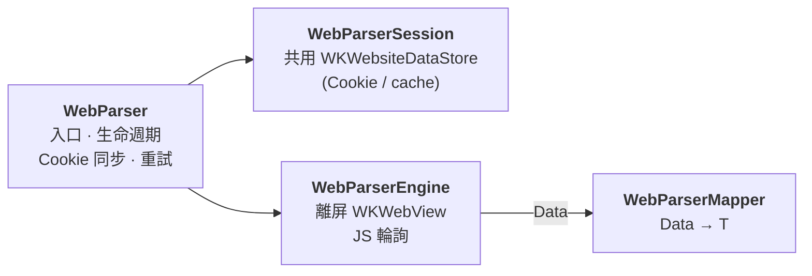

寫過爬蟲的人都經歷過這個瞬間：`URLSession` 把 HTML 抓回來，打開一看——

```html
<div id="app"></div>
<script src="/assets/index-a3f2c8.js"></script>
```

沒了。內容全靠 JavaScript 在 client 端渲染，你要的資料根本不在 HTML 裡。更麻煩的還有：資料是加密後才由 JS 解開的、要 Cookie 登入態的、或是 DOM 要等非同步請求回來才長出來的。

正攻法只有一條：**別解析 HTML 了，把頁面真的渲染出來，然後直接在頁面裡執行 JavaScript 把資料拿走。** iOS 上這件事的載體就是 `WKWebView`——只是不用把它放到畫面上。

這就是 [WebParser](https://github.com/shinrenpan/WebParser) 在做的事：一個基於 WKWebView 離屏渲染的 Swift 網頁解析框架，Swift 6.2、Strict Concurrency 全開。這篇拆解它的幾個關鍵設計——特別是 WebKit 這種 delegate 老世界，怎麼乾淨地橋進 async/await 新世界。

---

## 🏛️ 架構：四個元件串一條鏈



呼叫端看到的 API 非常小：給一個 `WebParserConfig`（URL + 要執行的 JS + 重試策略），挑一個 `Mapper`，拿回型別安全的結果：

```swift
struct Comic: Decodable {
  let title: String
  let updateDate: String
}

let results = try await parser.parse(
  with: config,
  mapper: WebParserJSJSONMapper<[Comic]>()
)
```

`executionJS` 回傳 JS 物件或陣列時，引擎會序列化成 JSON、`Mapper` 用 `JSONDecoder` 直接解成 `Decodable` 模型。回傳純文字（例如 `document.title`）就換 closure 型的 mapper 自己轉。

---

## 🌉 關鍵橋接一：CheckedContinuation 收服 delegate

WKWebView 的世界是 delegate callback：載入完成、載入失敗，各走各的回呼。要把它變成一個 `async` 函式，橋樑就是 `CheckedContinuation`：

```swift
func fetch() async throws -> Data {
  let wv = buildWebView()
  self.webView = wv
  wv.load(URLRequest(url: config.url, timeoutInterval: timeout))

  // withTaskCancellationHandler 確保外部 Task.cancel() 能立即中斷等待中的 continuation,
  // 而不是等到輪詢逾時才結束
  return try await withTaskCancellationHandler {
    try await withCheckedThrowingContinuation { self.continuation = $0 }
  } onCancel: {
    // onCancel 可能在非 MainActor 的執行緒觸發, 切回 MainActor 確保安全存取屬性
    Task { @MainActor [weak self] in
      self?.resumeWith(.failure(CancellationError()))
    }
  }
}
```

這段有兩個容易踩爆的地雷，各有對應的防禦：

**Double resume 會直接 crash。** delegate 的成功與失敗回呼、輪詢逾時、外部取消——四條路都可能想 resume 同一個 continuation。解法是把 resume 收斂到唯一入口，先清空再恢復：

```swift
private func resumeWith(_ result: Result<Data, Error>) {
  guard let continuation else { return }

  // 先清空再 resume, 確保即使有競爭條件也只會執行一次
  self.continuation = nil
  cleanup()

  switch result {
  case let .success(data): continuation.resume(returning: data)
  case let .failure(error): continuation.resume(throwing: error)
  }
}
```

**取消要能立即生效。** 沒有 `withTaskCancellationHandler` 的話，外面 `task.cancel()` 了，continuation 還在傻等輪詢逾時，WKWebView 資源就這樣被佔到天荒地老。掛上 cancellation handler，取消瞬間就走 `resumeWith(.failure(CancellationError()))` 收工釋放。

---

## 🔁 關鍵橋接二：輪詢迴圈與錯誤分流

SPA 最討厭的點：頁面「載入完成」不等於「資料長出來了」。`didFinish` 只代表主 frame 載完，真正的內容可能還在等 API 回來。所以 Engine 在 `didFinish` 之後進入**輪詢迴圈**——每秒執行一次你的 JS，直到結果非空或逾時：

```swift
while !Task.isCancelled, Date().timeIntervalSince(startTime) < timeout {
  do {
    let rawResult = try await webView.evaluateJavaScript(js)

    if let result = rawResult, isResultPresent(result) {
      let data = try JSONSerialization.data(withJSONObject: result, options: .fragmentsAllowed)
      resumeWith(.success(data))
      return
    }
    // 結果為空代表 DOM 尚未就緒 (常見於 SPA 非同步渲染), 繼續輪詢
  }
  catch let wkError as WKError where isFatalJSError(wkError) {
    // JS 語法錯誤或回傳類型不支援, 屬開發者錯誤, 直接失敗
    resumeWith(.failure(wkError))
    return
  }
  catch {
    // 其他非致命錯誤 (例如 WebView 尚在初始化), 繼續輪詢
  }

  try await Task.sleep(for: .seconds(1))  // 可取消的 sleep
}
```

我特別喜歡這裡的**錯誤分流**思路——不是所有錯誤都值得同等對待：

- **空結果** → DOM 還沒就緒，繼續等（這是正常情況，不是錯誤）
- **`javaScriptExceptionOccurred` / `javaScriptResultTypeIsUnsupported`** → 你的 JS 寫錯了，重試一百次也一樣，立刻失敗給你明確的錯誤
- **其他暫時性錯誤** → 吞掉繼續輪詢

同樣的分流哲學也出現在上層的重試迴圈：只有 `timedOut`、`networkConnectionLost` 這類**暫時性網路錯誤**才觸發重試，而且每次重試都建一個**全新的 Engine 實例**——WKWebView 的狀態絕不跨次污染。

---

## 📦 關鍵橋接三：用 `Data` 當 Sendable 邊界

Strict Concurrency 下有個安靜但重要的決定：`evaluateJavaScript` 回傳的是 `Any`——字典、陣列、`NSNumber`，全都不是 `Sendable`，讓它跨出 `@MainActor` 邊界就是編譯錯誤等著你。

WebParser 的解法乾脆：**在邊界上就地序列化成 `Data`**。`JSONSerialization` 把 JS 結果轉成 bytes，`Data` 是 `Sendable` 的，之後要去哪都行，`Mapper` 再從 `Data` 解回型別安全的模型。整個框架的 `@MainActor` 範圍（WKWebView 的硬性要求）就被這一道轉換乾淨地圈住了。

順帶一提幾個實用的小設計：

- **`blockMedia` 預設開啟**——離屏解析根本不需要載影音，`mediaTypesRequiringUserActionForPlayback = .all` 一擋，渲染速度和流量都省下來
- **Cookie 只同步目標網域**——`syncCookies(for: host)` 不會把其他 domain 的登入態一起帶進去
- **JS 腳本用 raw string** `#"""..."""#` 寫，跳脫字元的噩夢直接消失

---

## 📊 狀態機：讓 UI 知道現在卡在哪

解析一個慢網頁可能要十幾秒，UI 不能只轉一個無限 spinner。整個生命週期是一個明確的狀態機，透過 delegate 即時推送：

```
started → loading(progress:) → executingJavaScript → completed
                                     ↘ retrying(attempt:error:) ↘ failed(Error)
```

`loading` 的進度值直接來自 KVO 觀察 `estimatedProgress`，ViewModel 接上就能畫進度條：

```swift
func webParser(_ parser: WebParser, didUpdateState state: WebParserState) {
  if case let .loading(progress) = state {
    self.uiProgress = progress
  }
}
```

一個乾淨的細節：`.started` 在整個解析週期**只發一次**，重試期間不重發——UI 不會因為第三次 retry 又閃一次「開始中」。

---

## 💡 總結

- 對 JS 渲染的網頁，**與其解析 HTML 不如直接當個瀏覽器**：離屏 WKWebView 渲染 + 在頁面裡執行 JS 取數據
- delegate 世界橋進 async/await 的三件套：**`CheckedContinuation` + 單一 resume 入口防 double-resume + `withTaskCancellationHandler` 支援即時取消**
- 錯誤要**分流**：空結果繼續等、開發者錯誤立刻死、暫時性錯誤才重試——每類錯誤有自己該去的地方
- Strict Concurrency 下跨邊界傳資料，**在邊界上序列化成 `Data`** 是簡單有效的 Sendable 解法

程式碼和 MVVMC 架構的 Demo app（用真實漫畫站當解析範例）都在 repo：

👉 [github.com/shinrenpan/WebParser](https://github.com/shinrenpan/WebParser)

*本文使用 Claude 共同完成*
