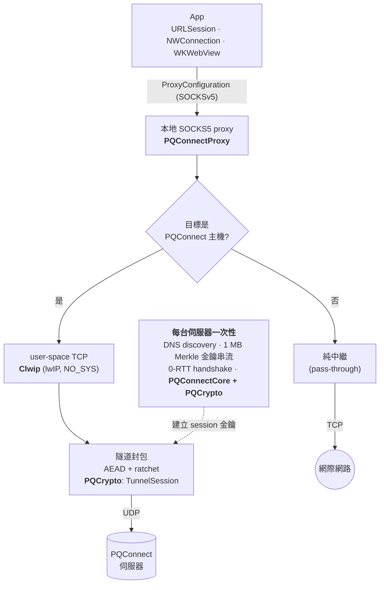

「現在先把加密流量整包錄下來，等量子電腦夠強再回頭解」——這種 *harvest now, decrypt later* 的攻擊模型，是後量子密碼學要處理的核心威脅。NDSS 2025 有一篇論文 *"PQConnect: Automated Post-Quantum End-to-End Tunnels"*（Bernstein、Lange、Levin、Yang），提出了一個很務實的做法：在 IP 層自動建立後量子端到端隧道，app 完全不用改，TLS 照跑，只是底下多墊一層量子電腦也啃不動的保護。

官方實作是 Python 的，跑在 Linux 上。看完之後我冒出一個念頭：

> **Swift 到底能不能端到端跑 PQConnect？** 不是接個現成 library，是從 DNS discovery、金鑰驗證、handshake、ratchet 到隧道封包，整條協定用 Swift 走完，最後讓 iOS app 真的透過隧道取回資料。

於是開了一個實驗專案。結論先講：**可以**——已對真實伺服器 `pqconnect.net` 實證，包含從 iOS 模擬器的 binary 實際取回 `HTTP 200, 131 bytes`。這篇記錄整個過程：架構長怎樣、踩了哪些坑、以及哪些東西刻意不做。

---

## 🏛️ 整體架構：一個本地 SOCKS5，三個 Apple 網路 API

先看全貌。核心設計是把所有複雜度收在一個**本地 SOCKS5 proxy** 後面，app 端只透過 Apple 標準的 `ProxyConfiguration` 接上來：



這個設計有兩個關鍵決定：

**機會式（opportunistic）逐連線路由。** 每條連線依自己的目標主機判斷：有啟用 PQConnect 的主機（透過 DNS 宣告偵測）就建立到其專屬伺服器的後量子隧道，其餘一律純中繼 pass-through。這跟參考 client 的行為一致——你不需要全世界都支援 PQConnect 才能用它。

**app 的 TLS 完全不動。** HTTPS 流量進隧道後等於有**兩層獨立保護**：照常的 TLS，加上底下 PQConnect 的後量子防護。就算哪天 TLS 的金鑰交換被量子電腦打穿，錄下來的流量還有一層 mceliece + sntrup761 擋著。

模組切分如下：

| 模組 | 角色 |
|---|---|
| `PQConnectCore` | 純 Swift 協定層：DNSCurve base32、announcement 解析、SHAKE256、Merkle `PKTree`、keyserver framing + UDP client |
| `PQCrypto` | 原生 KEM（mceliece6960119、sntrup761）、X25519 / ChaCha20-Poly1305（libsodium）、`Handshake`、`Ratchet`、`TunnelSession` |
| `Clwip` | lwIP（NO_SYS）user-space TCP 膠合層 |
| `PQConnectProxy` | **公開 API**：`PQConnectProxy.start()`，逐目的地路由的 SOCKS5 proxy |
| `pqc-cli` | macOS 驗證工具（`discover`、`fetchkey`、`ping`、`urlsession` …） |

---

## 🔐 協定層：拿官方 Python 實作當 oracle

Crypto 協定這種東西，「看起來能跑」跟「真的正確」是兩回事。錯一個 byte，handshake 就是安靜地失敗，你完全不知道錯在哪一步。

所以整個協定層的開發策略是：**把官方 `pqconnect-1.2.3` Python 實作當 oracle**，每個階段的每個中間值都跟它逐一比對——KDF 的輸出、handshake 的每一包、ratchet 前進後的金鑰，全部要 bit-exact 相符才算過關。48 個測試就是這樣一路鋪出來的。

協定本身分幾段：

1. **DNS discovery** — PQConnect 主機會在 DNS 裡用 DNSCurve base32 編碼宣告自己的伺服器位置與公鑰 hash
2. **金鑰取得** — 從 keyserver 串流下載約 1 MB 的 mceliece 長期公鑰，用 SHAKE256 Merkle tree（`PKTree`）逐塊驗證
3. **0-RTT handshake** — mceliece6960119（長期 KEM）+ sntrup761（臨時 KEM）+ X25519，經 ChaCha20 為基礎的 KDF 組合出 session 金鑰
4. **隧道穩態** — 之後就是把 TCP 分段包進 UDP 上的 AEAD 封包，配二維 ratchet 持續換鑰

其中有個小插曲值得記一筆：`mceliece6960119` 的 keypair 運算 stack 用量極大，在 Swift 測試的 worker thread（512 KB stack）上直接 **SIGBUS** 死給你看——純 C 的 smoke test 反而沒事，因為它跑在 8 MB 的 main thread 上。解法是測試裡開一條 32 MB 的顯式 `Thread` 去跑。keypair 本來就是伺服器端的事，client 用不到，但這種「同一份 code，換個 thread 就爆」的坑，不記下來以後一定再踩。

---

## 🧱 最花時間的反而不是 crypto：xcframework 打包

協定做通之後，本來以為剩下的都是下坡路——把 libmceliece、libntruprime、libsodium、lwIP 打包成 xcframework 而已嘛。

結果這段路上全是死胡同，而且每個死胡同都有同一個特徵：**平常 build 都好好的，直到 `xcodebuild -create-xcframework` 才翻臉**。djb 系的 library（libmceliece / libntruprime）有自己的一套 build 系統，其中 dispatch object 是由一條獨立的 host-tooling 路徑（`cdcompile`）編出來的——你把每個 crypto 編譯單元都改成 iOS target 也沒用，archive 裡還是混著 macOS platform 的 `.o`。而 iOS 的一般 build 照樣 link 得過（linker 只看 arch），所以問題完全隱形，直到打包那一刻才爆出 platform 不一致。

事後把這些死路全部記進 docs 的「don't-retry list」——這種 build 系統考古的成果，不寫下來等於白挖。

最後的成品是三個 slice 的 `PQConnectNative.xcframework`（`macos-arm64`、`ios-arm64`、`ios-arm64-simulator`），`Package.swift` 用 `.binaryTarget` 引用，macOS、iOS 實機、模擬器一次 build 自動選對 slice。

---

## 📱 收成：iOS demo，三個 API 全部接上

`ProxyConfiguration` 是 iOS 17+/macOS 14+ 的統一 proxy API，`URLSession`、`NWConnection`、`WKWebView` 三者共用。所以 library 的公開 API 可以收斂到非常小：

```swift
let proxy = try PQConnectProxy.start()   // 開本地 listener，隧道逐目的地延遲建立
let session = URLSession(configuration: proxy.urlSessionConfiguration())

// 或用統一 API，URLSession / NWConnection / WKWebView 通吃：
config.proxyConfigurations = [proxy.proxyConfiguration]
```

Demo app 是個很單純的 SwiftUI app，用 `@Observable` 的 controller 持有 proxy 一輩子：

```swift
@MainActor @Observable
final class ProxyController {
    private(set) var status: String
    private let proxy: PQConnectProxy?

    init() {
        do {
            let p = try PQConnectProxy.start()
            proxy = p
            status = "SOCKS5 proxy on 127.0.0.1:\(p.proxyPort)"
        } catch {
            proxy = nil
            status = "proxy failed to start: \(error)"
        }
    }

    /// WKWebView / Network.framework 用的統一 ProxyConfiguration
    var proxyConfiguration: ProxyConfiguration? { proxy?.proxyConfiguration }

    /// 流量走隧道的 URLSession（逐目的地路由）
    func makeURLSession() -> URLSession {
        guard let proxy else { return .shared }
        return URLSession(configuration: proxy.urlSessionConfiguration())
    }
}
```

REST 分頁用這個 session 去 GET `https://www.pqconnect.net/test.html`，Web 分頁把同一個 `proxyConfiguration` 掛到 `WKWebsiteDataStore` 上。在模擬器上實跑的結果：

```
[PQC-DEMO] REST ok: HTTP 200, 131 bytes
```

這行 log 背後是完整的一條鏈：DNS discovery → 1 MB Merkle 金鑰驗證 → 0-RTT 後量子 handshake → lwIP user-space TCP → TLS over 隧道 → 真的把 HTML 拿回來。

---

## 🚧 刻意不做的：系統級 VPN

看到這裡你可能會問：為什麼不直接做成 `NEPacketTunnelProvider` 的系統級 VPN，讓全機流量都走隧道？

這是刻意的範圍取捨，不是做不到：

- 研究問題——*Swift 能不能做 PQConnect？*——用逐 app 的 SOCKS5 + `ProxyConfiguration` 已經完整回答，而且這條路**不需要任何特殊 entitlement**，一般 app sandbox 就能跑
- `NEPacketTunnelProvider` 需要 Network Extension entitlement（付費開發者帳號 + provisioning），跑在記憶體限制嚴格的 extension 行程裡——那顆約 1 MB 的 mceliece 公鑰和 `encap` 的 stack 用量在那邊都要重新對待
- SOCKS 層以下的一切（crypto、handshake、ratchet、lwIP）未來要疊 VPN 都能原樣重用，只有封包捕捉的前端是新的

另外幾個已知缺口也照實記錄在 docs 裡，按「實際會不會咬到你」排序：keyserver 過載時的 cookie/resumption 沒處理（現在就可能碰到，會重試到 timeout）、ratchet 只做 epoch 0（短連線夠用，長壽命隧道不夠）、防重放與 hashcash PoW 未做。可行性研究的紀律就是：**缺口要記錄，不要隱藏**。

---

## 💡 總結

- **Swift 端到端跑 PQConnect 是可行的**——crypto、user-space TCP、隧道全部原生做完，對真實伺服器驗證，iOS 模擬器實際取回資料
- 拿官方實作當 **oracle 逐 bit 比對**，是移植 crypto 協定唯一睡得著覺的方法
- 最難的不是密碼學，是 **build 系統考古**——djb 系 library 的 xcframework 打包死路，值得一份 don't-retry list
- `ProxyConfiguration` 是被低估的 API：一個設定，`URLSession`、`NWConnection`、`WKWebView` 三個入口全部接上，不用碰任何 app 協定碼

完整的實作、docs（含 handshake 協定筆記、keyserver 協定、build 考古記錄）都在 repo 裡：

👉 [github.com/shinrenpan/PQConnectDemo](https://github.com/shinrenpan/PQConnectDemo)

*本文使用 Claude 共同完成*
