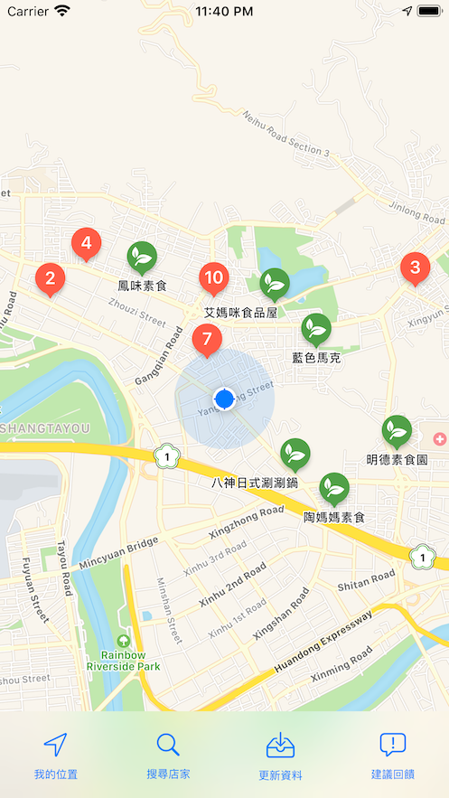

# 蔬店 App

App 原始碼: [GitHub](https://github.com/shinrenpan/Vegetarian)   
資料原始碼: [GitHub](https://github.com/shinrenpan/VegetarianMap)  

  

一款台灣蔬食餐廳搜尋地圖 App, 不侷限全素  
簡單三步驟搜尋附近蔬食餐廳 (最大範圍為地圖中心半徑兩公里)

- 步驟 1:  
點擊更新資料, 確保本地端為最新資料 (未更新將使用本地端資料)
- 步驟 2:  
移動地圖, 將中心點移動想要搜尋的範圍
- 步驟 3:  
點擊搜尋店家, 搜尋結果將顯示在地圖上

## 首頁功能
首頁下方四項功能:

### 我的位置
點擊後, 將你的位置顯示在地圖上, 並移動到該處.  
並會依照你的位置計算你與店家的距離.

> 未定位並不影響 App 的使用, 僅會影響顯示與店家的距離顯示

### 搜尋店家
點擊後, 從地圖中心點開始搜尋店家 (最大半徑為兩公里),  
搜尋結果將顯示在地圖上.

### 更新資料
點擊後, 從 Server 下載店家資訊, 並存在本地端.  
搜尋店家都是使用目前本地端資料.

### 建議回饋
點擊後, 可選擇發佈建議事項或是新增店家.  
1. 建議事項:  
回饋對此 App 的建議或是 bug.  
店家 bug 不應該在此回報, 應該在店家功能回報.

2. 新增店家:  
回饋要新增的店家, 必須包含店家名稱與住址.  
店家 bug 不應該在此回報, 應該在店家功能回報.

## 店家功能
在地圖上選取店家後, 進到列表後點擊呈現的功能:

### 在瀏覽器搜尋
點擊後, 將在 App 內開啟瀏覽器, 並使用 goole 搜尋店家資訊.

### 在 Apple Map 開啟
點擊後, 將跳出 App 並打開 Apple Map 定位置店家.

> 未安裝 Apple Map 將不會顯示此功能

### 在 Goole Map 開啟
點擊後, 將跳出 App 並打開 Google Map 定位置店家.

> 未安裝 Google Map 將不會顯示此功能

### 錯誤回報
點擊後, 可回報選取的店家錯誤:

1. 名稱錯誤
2. 住址錯誤
3. 其他錯誤 (倒閉或其他)

可在註記裡提供更多資訊.