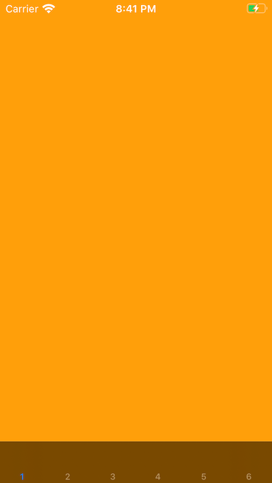

# UITabBarController 顯示超過 5 個 Tab

參考:  
[Stack Overflow](https://stackoverflow.com/questions/10313845/can-we-add-more-than-five-tab-bar-in-ios-sdk)  
[Apple Developer Forums](https://forums.developer.apple.com/thread/118599)  

1. Subclass UITabBarController  
2. Override traitCollection  

```swift
import UIKit

// 1. Subclass UITabBarController
final class MyTabBarController: UITabBarController {

    // 2. Override traitCollection
    override var traitCollection: UITraitCollection {
        let realTraits = super.traitCollection
        let fakeTraits = UITraitCollection(horizontalSizeClass: .regular)
        return UITraitCollection(traitsFrom: [realTraits, fakeTraits])
    }
}
```

